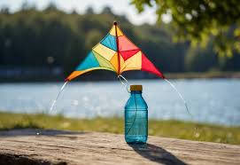
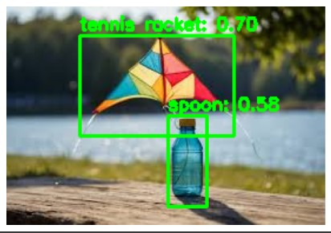

# ObjectDetection
Using Python
To Run this either you can use Google Colab Or Your Personal Editor

<h3>Through Google Colab</h3>
Copy the whole code and Open Google Collab With a new file and Paste the whole Code there and run it .
You can either make new shell and then make partitions of the code and run it sequentially to make the code run more Accurately.
Input Image
 
 
 
Output Image
 
 
 

<h3>Through Your Own Editor</h3>
Import all the required libraries into your system and then run the python file.
 
If you have any queries feel free to contact me at pari040105@gmail.com
My output are not accurate as i did not have enough time to train my model propely.
